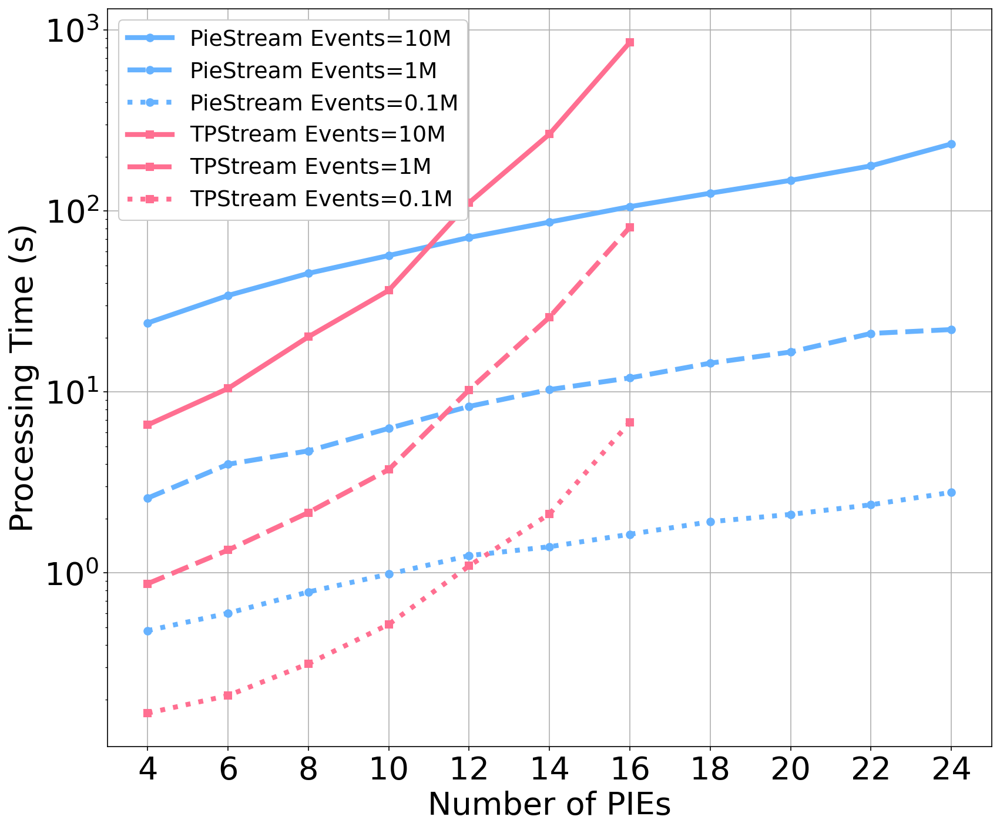
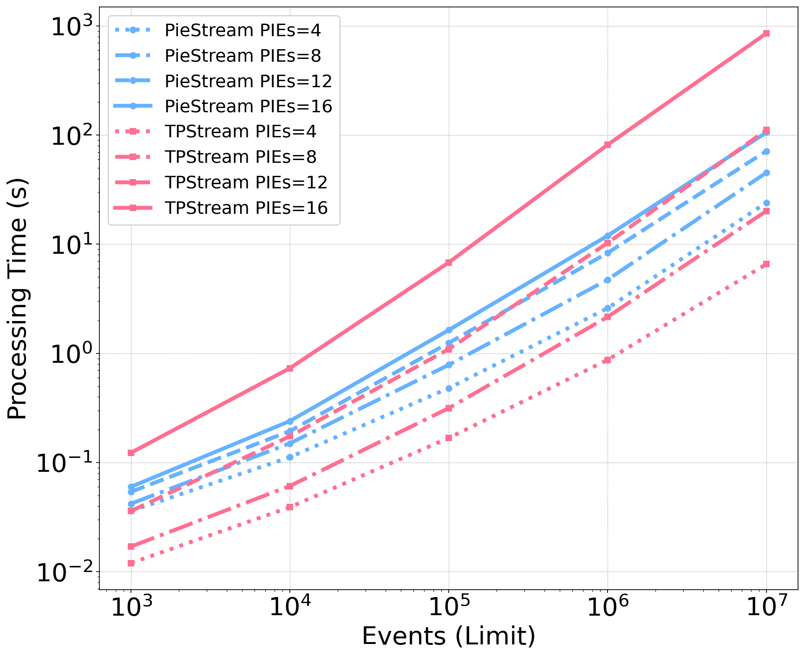

## PieStream

**PieStream** implements a method for efficient interval temporal pattern detection in complex event processing (CEP) for data streaming. 

Traditional CEP systems struggle with handling complex queries due to the inefficiency of sequential pattern matching. Our approach casts binary event pairs with interval relationships into regular expressions and automata, enabling low-latency pattern recognition. By decomposing complex patterns into independent event pairs and using natural joins, we achieve more accurate and efficient detection results. 

Experimental evaluations show that our method significantly outperforms state-of-the-art techniques, offering nearly quasilinear time and space complexity.

## About Paper

* **Title**: A Scalable Framework to Detect Interval Temporal Patterns in Data Streaming
* **Authors**: Zhongqing Chen, Feng Liu, Hongyu Jia, and Liang Zhang
* **Conference**: Submitted to the International Conference on Advanced Information Systems Engineering (CAiSE 2025)
* **PDF of the paper**:  [Full Paper](attachments/caise2025_paper_67_submission.pdf)
* **Proofs of theorem and the proposition in the paper**:  [appendix](attachments/appendix.pdf)

### Challenges

1. **Limitations in Handling Temporal Relationships**: Sequential Pattern Matching methods struggle with interval events that span time and their complex temporal relationships, particularly when events overlap or are related. Representing multiple Allen’s interval relations increases processing complexity.

2. **Scalability Issues with Existing Methods**: State-of-the-art methods like TPStream can detect interval event pairs with low latency but suffer from exponential complexity when dealing with complex patterns. As the problem size increases, the performance degrades significantly, making these methods unsuitable for large-scale, real-time streaming data scenarios.

### Proposed Method

To address the challenges of detecting complex temporal patterns in real-time streaming data, we propose a novel method that operates in two key steps:

1. **Decomposition and Detection of Binary Event Pairs**
Complex temporal patterns are first decomposed into simpler binary event pairs. These event pairs are represented using regular expressions and automata, enabling efficient and low-latency recognition of interval patterns. Each binary event pair is detected independently, with results obtained in constant time, making the detection process highly efficient.

2. **Efficient Assembly through Natural Joins**
Once the binary event pairs are detected, they are seamlessly joined using natural joins. This allows for efficient assembly of the full temporal pattern, with the entire process exhibiting nearly quasilinear time complexity.  

### Key Contributions

- Proposing a novel framework for transforming predicate-based interval event pairs into regular expressions and automata. This enables efficient encoding of temporal relationships, achieving low-latency detection for complex interval patterns in streaming data.

- Developing a scalable approach to support above framework, not only reduces time complexity from exponential to nearly quasilinear but also achieves nearly quasilinear space complexity, significantly improving the efficiency of handling complex queries in real-time streaming systems.

### Experiments

#### Processing Time

The experiment aimed to compare the processing time of **[PieStream](https://github.com/cyann7/PieStream)** and **[TPStream](http://uni-marburg.de/oaCPk)** using the same synthetic dataset of TPStream and query statements. The query complexity was varied by adjusting the number of PIEs, with each sequence of n PIEs forming n - 1 mPiePairs, each containing 6 Allen temporal relations.

The experiment used a window size of 10,000 and the fastest event input rate, testing different event counts (ranging from 10³ to 10⁷). Multiple trials were conducted, varying the number of PIEs from 4 to 24, to evaluate processing time and system scalability.


<div style="display: flex; justify-content: space-around;">
    
    
</div>

The left figure shows that PieStream’s processing time increases quasilinearly with problem size, while TPStream grows exponentially. TPStream fails when the number of PIEs exceeds 16 due to its direct matching approach. PieStream, though slower for small problems due to overhead from index construction, outperforms TPStream as the problem size increases by reducing redundant computations through indexing and result management.

The right figure shows that PieStream’s processing time remains lower than TPStream once the number of PIEs exceeds 12. While TPStream performs better for small sizes, the performance gap widens as the problem size grows. 

Note: Experiments of PieStream are all included in `scripts` folder.

### Conclusion

We propose a novel framework for efficient complex event processing (CEP) that casts binary event pairs with interval relationships into regular expressions and automata, enabling low-latency recognition. By decomposing complex patterns into independent event pairs and using natural joins, we achieve more accurate and efficient detection. Experimental results show that our approach outperforms state-of-the-art methods in handling complex queries.


## How to Run the Code

1. Clone the repository:

    ```bash
    git clone git@github.com:cyann7/PieStream.git
    cd PieStream
    ```

2. Compile the source code:

    ```bash
    mvn clean install
    ```

3. Modify `scripts/env` and run the experiment scripts in `scripts` folder.
   
    ```bash
    cd scripts
    # firstly modify scripts/env 
    ./processedTime.sh
    ```
4. Review the results in the `scripts/out` directory.

## Acknowledgements

This work is supported by Projects of International Cooperation and Exchanges NSFC-DFG (Grant No. 62061136006).

## Contact

For questions or comments, please contact **Zhongqing Chen** at [21210240135@m.fudan.edu.cn](mailto:21210240135@m.fudan.edu.cn) or **Liang Zhang** at [lzhang@fudan.edu.cn](mailto:lzhang@fudan.edu.cn)